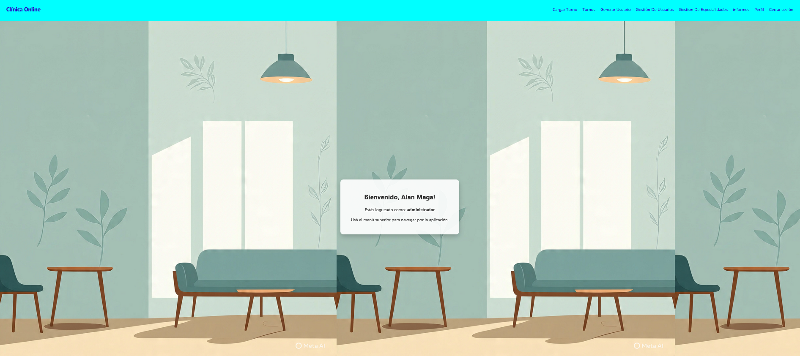
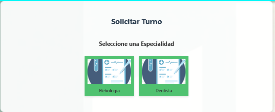
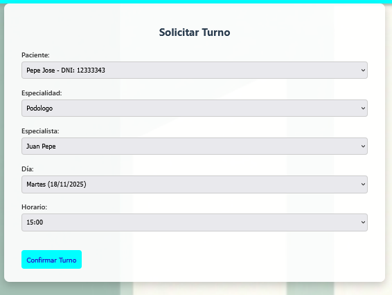
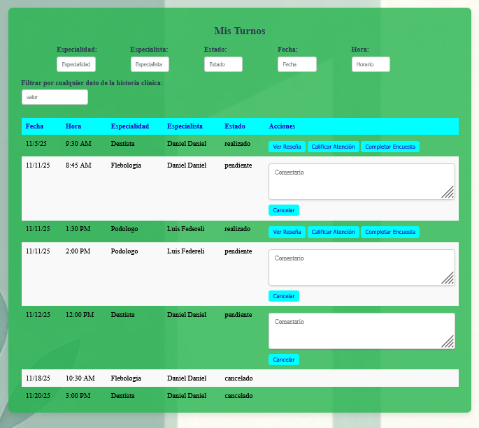
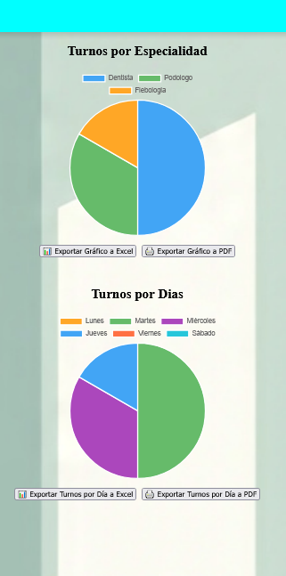

# ClinicaOnline

ClinicaOnline es una aplicación web de gestión y reserva de turnos médicos en una clínica. Permite a los pacientes seleccionar especialistas, especialidades, fechas y horarios disponibles, mientras que los administradores pueden gestionar pacientes, especialistas y turnos desde un panel interactivo.

## Navegación y uso de la aplicación

La app comienza aqui, si ya tienes un usuario puedes iniciar sesion, sino deberas crear uno antes eligiendo si sera paciente o especialista.

Una vez seleccionado debes completar los campos:

Una vez que ya tienes un usuario registrado podras iniciar sesion desde este login que cuenta con algunos accesos rapidos para facilitar el inicio de sesion

na vez que hayas iniciado sesion como paciente la app te llevara a este home dese el cual, podras acceder a las distintas secciones que ofrece la app desde la barra de navegacion

Para solicitar un turno deberas dirigirte a la seccion "Solicitar turno" en la barra de navegacion y en la primera parte deberas seleccionar el especialista con el que quieres tomar un turno
 

Luego una de sus especialidades

Y por ultimo un dia y horario que nos ofrece la app para ese especialista y esa especialidad y luego tocar el boton de "Confirmar Turno"

o un admin puede hacerlo por vos:
 

Luego si quieres ver tus turnos tendras que dirigirte a la seccion "Mis turnos" en la barra de navegacion y ahi podras ver todos tus turnos con sus respectivos estados, esta seccion cuenta con una serie de filtros por los que podras buscar turnos especificas segun el filtro que uses

Ademas se pueden observar informes desde el perfil administrador.

